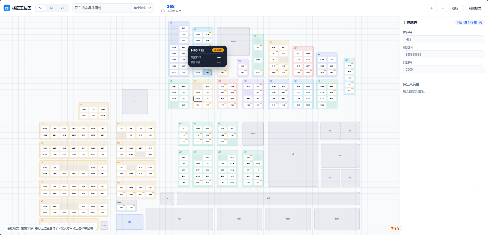
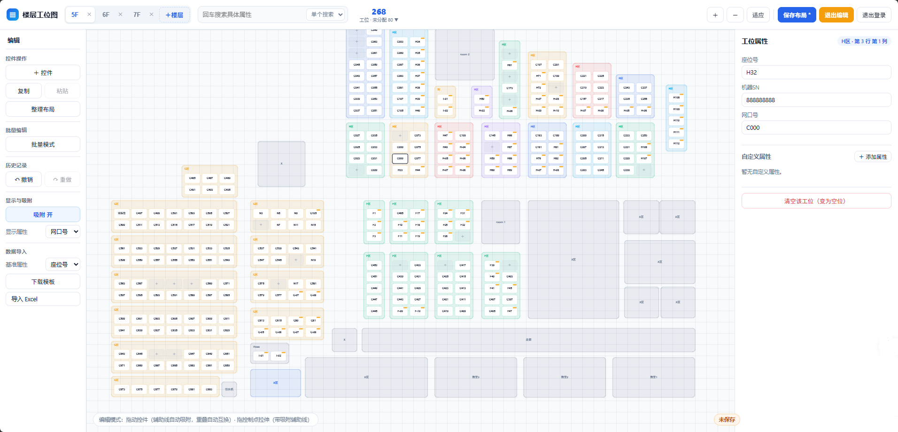
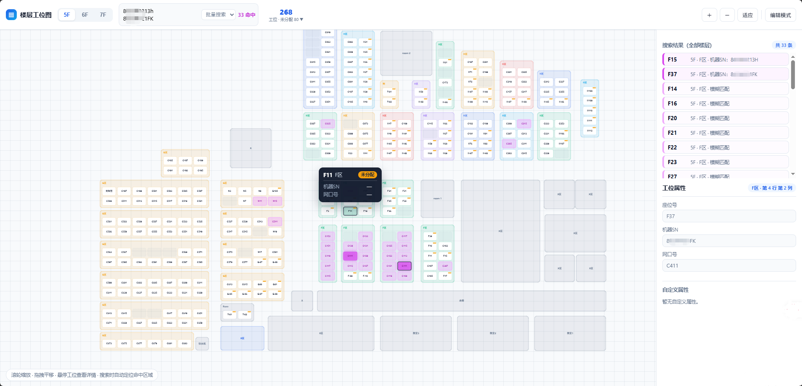
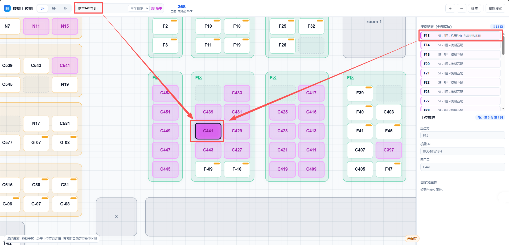
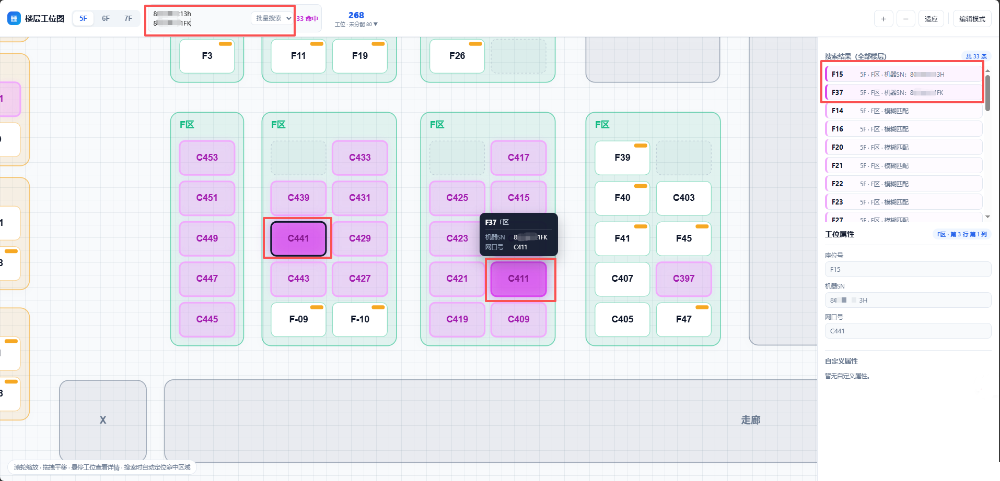
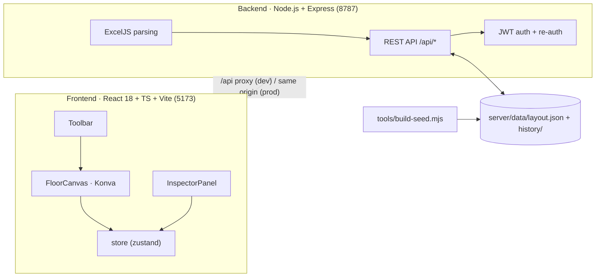

# seatmap · Asset Layout Map / Seat Map

**English** | [简体中文](./README.md)

[](./LICENSE)
[](https://react.dev)
[](https://www.typescriptlang.org)
[](https://vitejs.dev)
[](https://nodejs.org)
[](https://github.com/Cyouooo/seatmap/actions/workflows/ci.yml)

> A visual **floor asset-layout / seat-map** system. Visitors can switch floors and search workstations by any attribute — name, seat number, machine SN, port number, or custom fields. Admins drag and edit area blocks and seat cells directly on the canvas, with custom attributes, bulk Excel import and two-step authentication. Layout data is stored server-side as JSON with automatic backups.

> 🤖 **Created by AI**: the code, documentation and UI were produced with AI assistance. Please evaluate and test thoroughly before use.

> ⚠️ **Not recommended for public-internet deployment**: this project targets intranet / single-host use. Its built-in auth and password mechanisms are basic and have not been hardened for the open internet. Do not expose it directly to the public internet; if remote access is required, place it behind a reverse proxy / VPN / zero-trust gateway and perform your own security assessment.

---

## Table of Contents

- [1. Overview](#1-overview)
- [2. Screenshots](#2-screenshots)
- [3. Key Features](#3-key-features)
- [4. Quick Start](#4-quick-start)
- [5. Deployment](#5-deployment)
- [6. Configuration](#6-configuration)
- [7. Project Structure](#7-project-structure)
- [8. Tech Stack & Open-Source Dependencies](#8-tech-stack--open-source-dependencies)
- [9. Architecture & Data Model](#9-architecture--data-model)
- [10. Excel Import Format](#10-excel-import-format)
- [11. Development & Testing](#11-development--testing)
- [12. FAQ](#12-faq)
- [13. License](#13-license)
- [14. Acknowledgements](#14-acknowledgements)

---

## 1. Overview

**seatmap** turns every floor, zone and workstation (plus the devices on them) of an office building into a searchable, maintainable visual map on a canvas you can zoom and pan.

It solves three concrete problems:

1. **Find people / devices** — fuzzy search across all floors by name, seat number, machine SN, port number or any custom attribute. Matches are highlighted on the canvas and auto-focused.
2. **Edit layouts** — admins add/remove floors, place zone blocks and adjust seat grids by dragging, with alignment snapping, overlap prevention, undo/redo and batch editing — all WYSIWYG.
3. **Bulk data maintenance** — import a column of data from Excel (seat number ↔ machine SN / port number / custom attributes) with a row-by-row diff preview before anything is written.

The data model is a four-level structure — **Floor → Block → Seat → SeatField** — persisted as a single JSON document, so no database is required.

---

## 2. Screenshots

> The screenshots below use **demo data**.

**View mode** — floor switching, seat totals, hover details, zoom-to-fit:



**Edit mode** — left category toolbar + canvas drag + right property panel:



**Search highlight** — matches highlighted in magenta (strong) / light magenta (weak), with a synchronized result list:



**Single search** — exact hits switch floor automatically and zoom in:



**Batch search** — paste a column of queries, split by newline and deduplicated, auto-focus strong hits:



---

## 3. Key Features

### 3.1 View mode (no login)

1. **Floor switching** — one-click floor switch in the toolbar.
2. **Cross-floor search** — "single" and "batch" modes; batch mode accepts a column pasted from a text editor or Excel, split by newline and deduplicated. Enter to search, Esc to clear; live counts of matches and total seats.
3. **Graded highlighting** — strong hits in magenta, weak hits in light magenta; the right panel lists cross-floor results with full seat attributes. Single-search exact hits switch floor and center-zoom; batch search auto-focuses the strong-hit region.
4. **Hover detail popover** — seat number, zone, machine SN, port number and all custom attributes.
5. **Statistics breakdown** — click the seat total to expand assigned / unassigned / empty / text-block counts, grouped by zone and floor.
6. **View controls** — zoom and zoom-to-fit; Canvas 2D rendering stays smooth with thousands of seats.
7. **Dark mode** — light/dark theme toggle with persistence.

### 3.2 Edit mode (login required)

8. **Floor management** — add, double-click to rename, delete floors (Ctrl+Z to undo).
9. **Category toolbar (left)** — Controls / Batch / History / Display & Snapping / Data Import, working alongside the right property panel.
10. **Drag & resize** — move and resize blocks; alignment guides + 10px grid snapping (global or per-block), also applied while resizing, with automatic seat add/remove.
11. **Never-overlapping blocks** — new blocks find a free spot, drag-overlaps auto-swap, manual numeric edits trigger a unified overlap check, and "Tidy layout" resolves all overlaps on a floor.
12. **Copy & undo** — copy/paste (Ctrl+C / Ctrl+V), undo/redo (Ctrl+Z / Ctrl+Shift+Z, snapshot history up to 60 steps).
13. **Batch marquee editing** — batch delete, unify color, unify width/height, equal horizontal/vertical spacing, six-way alignment, group move.
14. **Free seat add/remove** — click "＋" on an empty cell to add a seat; clear a seat back to empty; drag to swap seats (including onto empty cells).
15. **Attribute display** — single-line seats with a "display attribute" dropdown (seat number / machine SN / port number / any custom attribute), saved with the layout.

### 3.3 Data & security

16. **Excel / CSV bulk import** — choose a key attribute → download template → fill in → upload → row-by-row diff preview (update / unchanged / unmatched / new fields) → confirm to write.
17. **Authentication** — JWT login (8h) + two-step verification for sensitive actions (5m); server-side per-endpoint authorization.
18. **Automatic backups** — the previous layout is backed up to `server/data/history/` before every save (latest 10 kept), with one-click restore from any snapshot.
19. **Safe writes** — in-process serialized writes + atomic replacement (temp file + rename) to avoid concurrent overwrites and partial files.

---

## 4. Quick Start

### 4.1 Requirements

| Item | Requirement |
| --- | --- |
| Node.js | **≥ 18** (20 LTS or newer recommended; developed and verified on Node 24) |
| Package manager | npm (bundled with Node) |
| OS | Windows / macOS / Linux |

### 4.2 Install

```bash
git clone https://github.com/Cyouooo/seatmap.git
cd seatmap/seatmap
npm install
```

### 4.3 Initialize layout data (optional)

Runtime data under `server/data/` is not committed. The repo ships a **synthetic sample workbook** (fictional data, safe to use) for demo purposes:

```bash
# Generate the initial layout from the synthetic sample into server/data/layout.json
npm run seed -- "samples/seatmap-sample.xlsx" --force

# Or use your own workbook (omit --force first to preview without writing)
npm run seed -- "..\your-seatmap.xlsx"
```

> You can skip this step: without layout data the app still starts — just create a blank floor in edit mode and start drawing.

### 4.4 Development

```bash
npm run dev:server      # Terminal A: backend API (default 8787)
npm run dev             # Terminal B: frontend (default 5173, /api proxied to 8787)
```

Open <http://127.0.0.1:5173>.

### 4.5 Production

```bash
npm run build           # build frontend to dist/
npm start               # backend serves dist/ and the API (default 8787)
```

Open <http://127.0.0.1:8787>.

---

## 5. Deployment

> ⚠️ **Not recommended for public-internet deployment.** This project targets intranet / single-host use; its auth and password mechanisms are basic and have not been hardened for the open internet. Do not expose it directly to the public internet. If remote access is required, put it behind a reverse proxy / VPN / zero-trust gateway and perform your own security assessment.

### 5.1 Single-host deployment (recommended, simplest)

Same origin: after `npm run build`, Express serves the `dist/` bundle and the `/api` endpoints — **one Node process, one port**.

```bash
# 1) Environment
node -v                 # must be >= 18

# 2) Get the code and install
git clone https://github.com/Cyouooo/seatmap.git
cd seatmap/seatmap
npm ci                  # exact install from package-lock.json

# 3) Configure (change the default password!)
export SEATMAP_USER=admin
export SEATMAP_PASSWORD='a-strong-password'
export PORT=8787
# export JWT_SECRET='optional fixed secret; if unset, generated on first boot into server/data/secret.key'

# 4) Build and start
npm run build
npm start
```

Visit `http://<server-ip>:8787`. In production, put Nginx / Caddy in front and enable HTTPS.

**Auto-start (Linux + systemd example)**

```ini
# /etc/systemd/system/seatmap.service
[Unit]
Description=seatmap
After=network.target

[Service]
WorkingDirectory=/opt/seatmap/seatmap
Environment=NODE_ENV=production
Environment=PORT=8787
Environment=SEATMAP_PASSWORD=replace-with-a-strong-password
ExecStart=/usr/bin/node server/index.js
Restart=always

[Install]
WantedBy=multi-user.target
```

```bash
sudo systemctl daemon-reload
sudo systemctl enable --now seatmap
```

### 5.2 Split deployment (optional)

- **Frontend**: `npm run build` produces `seatmap/dist/`; host it on any static server / CDN.
- **Backend**: run `node server/index.js` separately and reverse-proxy `/api` with Nginx.
- By default the backend only allows same-origin and localhost origins. For split hosting, declare your frontend domain via `SEATMAP_CORS_ORIGINS` (comma-separated).

```nginx
location /api/ {
    proxy_pass http://127.0.0.1:8787;
    proxy_set_header Host $host;
    proxy_set_header X-Real-IP $remote_addr;
}
```

### 5.3 Docker (optional, DIY)

There are no external dependencies (no database). A Dockerfile only needs a `node` base image, the source, `npm ci && npm run build`, and `CMD ["node","server/index.js"]`. Mount `server/data/` as a volume to persist layouts and backups.

### 5.4 Upgrade & backup

- **Upgrade**: `git pull` → `npm ci` → `npm run build` → restart.
- **Backup**: periodically back up `server/data/` (`layout.json` + `history/` + `secret.key`). Restore by copying the whole directory back.
- **Rollback**: use the "History" dialog in edit mode to restore any of the latest 10 snapshots.

---

## 6. Configuration

All configuration is via **environment variables**, each with a working default.

| Variable | Default | Required | Description |
| --- | --- | --- | --- |
| `SEATMAP_USER` | `admin` | No | Admin login username. |
| `SEATMAP_PASSWORD` | `admin123` | **Change in production** | Admin login password. Only a bcrypt hash is kept in memory for comparison; the plaintext is never persisted. |
| `PORT` | `8787` | No | Backend listening port (also serves the frontend in production mode). |
| `JWT_SECRET` | auto-generated | No | JWT signing secret. If unset, a random 32-byte secret is generated on first boot into `server/data/secret.key`. Multi-instance deployments must set the same secret explicitly. |
| `SEATMAP_CORS_ORIGINS` | empty | No | Extra allowed CORS origins, comma-separated. By default only same-origin and localhost (`localhost` / `127.0.0.1` / `[::1]`) are allowed. |

**Windows (cmd)**

```bat
set SEATMAP_PASSWORD=your-strong-password
set PORT=8787
npm start
```

**Linux / macOS**

```bash
export SEATMAP_PASSWORD='your-strong-password'
export PORT=8787
npm start
```

> ⚠️ **Security note**: always change `SEATMAP_PASSWORD` in production and keep `server/data/` (which holds the JWT secret and layout data) safe.

---

## 7. Project Structure

```
seatmap/                                 # repository root
├── LICENSE                              # MIT license
├── README.md                            # Chinese docs
├── README.en.md                         # English docs (this file)
├── .editorconfig                        # cross-editor indent / EOL / encoding
├── .gitignore                           # ignore temp dirs, build output, local data files and runtime data
├── .github/
│   └── workflows/ci.yml                 # GitHub Actions: install → lint → typecheck → test → build
├── docs/
│   └── images/                          # README screenshots
│       ├── view-mode.png                # View mode
│       ├── edit-mode.png                # Edit mode
│       ├── search-highlight.png         # Search highlight
│       ├── search-single.png            # Single search
│       └── search-batch.png             # Batch search
│
└── seatmap/                             # main application
    ├── index.html                       # Vite entry HTML (#root mount)
    ├── vite.config.ts                   # frontend config: port 5173, /api proxy to 8787, chunking
    ├── tsconfig.json                    # TypeScript config (strict, bundler resolution, jsx: react-jsx)
    ├── package.json                     # dependencies and scripts (dev / build / seed / start / test / lint)
    ├── package-lock.json                # lockfile (npmjs registry only)
    ├── .eslintrc.json                   # ESLint rules
    ├── .prettierrc.json                 # Prettier rules
    ├── .prettierignore                  # Prettier ignore list
    ├── .gitignore                       # ignore node_modules / dist / server/data
    ├── README.md                        # app-level docs (feature matrix, Excel format)
    │
    ├── src/                             # frontend source
    │   ├── main.tsx                     # entry: mount React app to #root
    │   ├── App.tsx                      # app shell: auth flow, load/save, import orchestration, shortcuts
    │   ├── store.ts                     # zustand global state + snapshot undo/redo (up to 60 steps)
    │   ├── types.ts                     # data model: LayoutDoc / Floor / Block / Seat / SeatField
    │   ├── styles.css                   # global styles (incl. dark-theme variables)
    │   ├── components/
    │   │   ├── Toolbar.tsx              # top bar: floors, search, stats, zoom/fit, theme, edit toggle
    │   │   ├── EditBar.tsx              # left category toolbar (controls/batch/history/display/import)
    │   │   ├── FloorCanvas.tsx          # Konva canvas: blocks & seats, drag/resize/snap/zoom/highlight
    │   │   ├── InspectorPanel.tsx       # right panel: block tuning / seat attributes / batch / results
    │   │   ├── HistoryDialog.tsx        # history snapshots dialog: list and restore backups
    │   │   ├── ImportPreviewDialog.tsx  # Excel import diff view: row-by-row preview then confirm
    │   │   └── PasswordDialog.tsx       # login / re-auth dialog
    │   └── lib/
    │       ├── api.ts                   # backend API wrapper (fetch + token / reauth headers)
    │       ├── fuzzy.ts                 # strong/weak match search (fuse.js + substring strong hits)
    │       ├── fuzzy.test.ts            # fuzzy unit tests
    │       ├── layout.ts                # geometry: size constants, grid, auto-size, snap, overlap, stats
    │       └── layout.test.ts           # layout unit tests
    │   └── store.test.ts                # store unit tests (undo merging etc.)
    │
    ├── server/                          # backend
    │   ├── index.js                     # Express: JWT auth, layout IO, history snapshots, Excel import, static hosting
    │   └── data/                        # runtime data (gitignored)
    │       ├── layout.json              # current layout data
    │       ├── history/                 # automatic backups (latest 10 kept)
    │       └── secret.key               # JWT secret (generated on first boot)
    │
    ├── tools/
    │   ├── build-seed.mjs               # build initial layout from Excel (floor map + seat data → JSON)
    │   └── make-sample.mjs              # generate the synthetic sample workbook (fictional, safe to commit)
    ├── samples/
    │   └── seatmap-sample.xlsx          # synthetic sample workbook (no real data)
    └── dist/                            # production build output (gitignored, from npm run build)
```

### File reference

| File | Purpose |
| --- | --- |
| `seatmap/src/App.tsx` | Orchestration layer: load layout, login/re-auth, save, import, shortcuts, wiring canvas and panels. |
| `seatmap/src/store.ts` | Single source of truth: layout doc, current floor, edit/batch mode, selection, query, undo stack, auth tokens. |
| `seatmap/src/lib/layout.ts` | Pure geometry library: seat cell constants, `autoBlockSize`, `seatRect`, `findFreeSpot`, `resolveOverlaps`, `alignmentSnap`, `seatStats`, etc. |
| `seatmap/src/lib/fuzzy.ts` | Search core: build seat index, fuse.js fuzzy matching + substring exact hits, output strong/weak matches. |
| `seatmap/src/lib/api.ts` | Unified backend API wrapper, automatically attaching `Authorization` / `X-Reauth` headers. |
| `seatmap/server/index.js` | All backend logic: auth, rate limiting, CORS, layout read/write with atomic persistence, history snapshots, template export, Excel parsing/import, production static hosting. |
| `seatmap/tools/build-seed.mjs` | Data bootstrap: parse the Excel "floor map" and "seat data" sheets, aggregate into blocks via connected components, emit `layout.json`. |
| `seatmap/tools/make-sample.mjs` | Generate the synthetic sample workbook so the public repo ships runnable demo data. |

---

## 8. Tech Stack & Open-Source Dependencies

This project is built on the following open-source projects — thanks to their authors and communities:

### Runtime dependencies

| Dependency | Version | Purpose | Homepage |
| --- | --- | --- | --- |
| React | ^18.3 | UI framework | <https://react.dev> |
| react-dom | ^18.3 | React DOM rendering | <https://react.dev> |
| Konva | ^9.3 | Canvas 2D library (drag / transform / events) | <https://konvajs.org> |
| react-konva | ^18.2 | React bindings for Konva | <https://github.com/konvajs/react-konva> |
| zustand | ^4.5 | Lightweight state management (undo/redo) | <https://github.com/pmndrs/zustand> |
| fuse.js | ^7.0 | Fuzzy search (weak matches) | <https://fusejs.io> |
| Express | ^4.19 | Backend web framework (API + static hosting) | <https://expressjs.com> |
| jsonwebtoken | ^9.0 | JWT session and re-auth tokens | <https://github.com/auth0/node-jsonwebtoken> |
| bcryptjs | ^2.4 | Admin password hashing & verification | <https://github.com/dcodeIO/bcrypt.js> |
| multer | ^2.0 | Excel upload (memory storage, ≤ 25MB/file) | <https://github.com/expressjs/multer> |
| ExcelJS | ^4.4 | Excel / CSV parsing and template generation | <https://github.com/exceljs/exceljs> |
| express-rate-limit | ^8.7 | Rate limiting for login / re-auth | <https://github.com/express-rate-limit/express-rate-limit> |
| cors | ^2.8 | CORS control | <https://github.com/expressjs/cors> |
| dotenv | ^16.4 | Environment variable loading | <https://github.com/motdotla/dotenv> |

### Development dependencies

| Dependency | Version | Purpose | Homepage |
| --- | --- | --- | --- |
| Vite | ^5.4 | Frontend build & dev server | <https://vitejs.dev> |
| @vitejs/plugin-react | ^4.3 | React plugin for Vite | <https://github.com/vitejs/vite-plugin-react> |
| TypeScript | ^5.6 | Type system & checking | <https://www.typescriptlang.org> |
| Vitest | ^2.1 | Unit testing framework | <https://vitest.dev> |
| ESLint | 8.57 | Linting | <https://eslint.org> |
| @typescript-eslint | 7.18 | TypeScript ESLint support | <https://typescript-eslint.io> |
| Prettier | 3.3 | Code formatting | <https://prettier.io> |
| eslint-config-prettier | 9.1 | Disable rules conflicting with Prettier | <https://github.com/prettier/eslint-config-prettier> |
| eslint-plugin-react-hooks | 4.6 | React Hooks rules | <https://github.com/facebook/react> |
| @types/* | — | Type declarations | <https://github.com/DefinitelyTyped/DefinitelyTyped> |

> License compliance: all dependencies use permissive licenses (MIT / Apache-2.0 / ISC / BSD, etc.), compatible with this project's MIT license.

---

## 9. Architecture & Data Model

### 9.1 Architecture



### 9.2 Data model

```
LayoutDoc
 ├─ version: number          # increments on each save
 ├─ updatedAt: string        # last update time (ISO)
 ├─ seatLabelField?: string  # default attribute shown on seats
 └─ floors: Floor[]
     └─ Floor { id, name, blocks: Block[] }
         └─ Block {            # zone block
              id, x, y, width, height,
              text,            # zone label, e.g. "Zone H"
              color,           # theme color
              cols, rows,      # seat grid
              showSeats,       # whether seats are shown
              seatPrefix,      # seat-number prefix
              snapEnabled?,    # whether snapping applies
              seats: Seat[]
            }
             └─ Seat {
                  seatNo,      # seat number
                  machineSN,   # machine SN
                  portNo,      # port number
                  fields: SeatField[]  # custom attributes
                }
                 └─ SeatField { key, label, value }
```

### 9.3 Geometry constants

| Constant | Value | Meaning |
| --- | --- | --- |
| `CELL_W` × `CELL_H` | 84 × 52 | single seat cell size |
| `GAP` | 10 | gap between seats |
| `PAD` | 14 | block inner padding |
| `TITLE_H` | 30 | title-bar height of a block with seats |
| `GRID_SNAP` | 10 | snapping step while dragging / tidying |
| `BLOCK_GAP` | 14 | safety gap between blocks (overlap prevention) |

Overlap prevention uses spiral nearest-free-spot search (`findFreeSpot`); floor-wide tidying uses `resolveOverlaps`; resizing a block with seats derives the grid via `colsRowsFromSize`, adding/removing seats automatically.

### 9.4 API endpoints

| Method | Path | Auth | Description |
| --- | --- | --- | --- |
| GET | `/api/health` | No | Health check |
| GET | `/api/layout` | No | Read the current layout |
| PUT | `/api/layout` | Login + re-auth | Save layout (serialized + atomic write + auto backup) |
| POST | `/api/auth/login` | Rate-limited | Login; issues an 8h session token and a 5m re-auth token |
| POST | `/api/auth/reauth` | Login + rate-limited | Re-auth; returns a fresh re-auth token |
| GET | `/api/history` | Login | List history snapshots |
| POST | `/api/history/restore` | Login + re-auth | Restore a given snapshot |
| GET | `/api/template` | Login | Export an Excel import template keyed by a chosen attribute |
| POST | `/api/import/preview` | Login | Upload and diff-preview (no write) |
| POST | `/api/import/apply` | Login + re-auth | Confirm and write |

---

## 10. Excel Import Format

The first row is the header and **must contain a `座位号` or `工位号` column**; other columns are matched by header name:

- `主机SN` / `机器SN` / `SN` / `主机序列号` → mapped to **machine SN**
- `网口号` / `网口` / `端口号` / `端口` → mapped to **port number**
- any other column → a **custom attribute** on the seat (created automatically if new)

Both `.xlsx` and `.csv` are supported. Recommended flow:

> Edit mode → "Template" (keyed by the chosen attribute, with existing attribute columns) → fill in → "Import Excel" → confirm row by row in the diff view → write.

Upload limit is 25 MB per file; import previews are held in memory for 30 minutes.

---

## 11. Development & Testing

```bash
npm run dev            # start frontend dev server (5173)
npm run dev:server     # start backend (8787)
npm run typecheck      # TypeScript type check
npm run test           # Vitest unit tests (layout / fuzzy / store)
npm run lint           # ESLint
npm run lint:fix       # ESLint auto-fix
npm run format         # Prettier format
npm run format:check   # Prettier check
npm run build          # production build
```

**CI**: `.github/workflows/ci.yml` runs `npm ci → lint → typecheck → test → build` on push / PR.

**Debug hooks**: the browser console exposes `window.__seatmap` for the zustand store, `Konva`, `getStage()` / `getLayer()`:

```js
__seatmap.store.getState().doc.floors[0].blocks.length;
```

---

## 12. FAQ

**Q: Can I use it without an Excel file?**
Yes. Start the app, enter edit mode, create a floor and draw zones and seats manually.

**Q: Where is the data stored? How do I migrate?**
Everything lives in `seatmap/server/data/`: `layout.json` (current layout), `history/` (backups), `secret.key` (secret). Copy the whole directory to migrate. Changing the secret invalidates issued login tokens — just log in again.

**Q: I forgot the admin password.**
It comes from the `SEATMAP_PASSWORD` environment variable (default `admin123`). Change it and restart the process.

**Q: Can multiple people edit at once?**
Browsing is concurrent; writes are serialized in-process and backed up before saving. Edit mode is not real-time collaborative — one editor at a time is recommended.

**Q: What is shown on each seat?**
Seat number by default; switch to machine SN / port number / any custom attribute via "Display attribute" in edit mode. The setting is saved with the layout.

---

## 13. License

Released under the [MIT License](./LICENSE). Free to use, modify and distribute.

---

## 14. Acknowledgements

Thanks to [React](https://react.dev), [Konva](https://konvajs.org), [Vite](https://vitejs.dev), [zustand](https://github.com/pmndrs/zustand), [fuse.js](https://fusejs.io), [Express](https://expressjs.com), [ExcelJS](https://github.com/exceljs/exceljs) and the many other excellent open-source projects.
