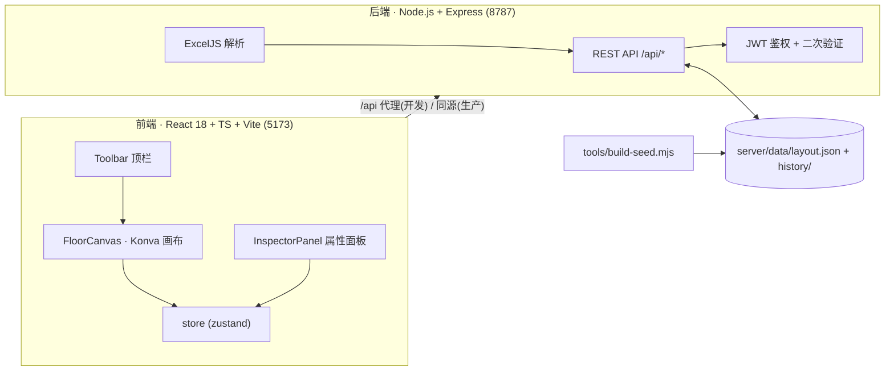

# seatmap · 资产分布图 / 座位图

[English](./README.en.md) | **简体中文**

[](./LICENSE)
[](https://react.dev)
[](https://www.typescriptlang.org)
[](https://vitejs.dev)
[](https://nodejs.org)
[](https://github.com/Cyouooo/seatmap/actions/workflows/ci.yml)

> 一个可视化的**楼层资产分布图 / 工位座位图**系统。浏览者可切换楼层、按姓名 / 座位号 / 机器 SN / 网口号等任意属性搜索工位；管理员在画布上拖拽编辑区域控件与工位格子，支持自定义属性、Excel 批量导入与二次身份验证，布局数据以 JSON 形式保存在服务端并自动备份。

> 🤖 **本项目由 AI 创作**：代码、文档与界面均在 AI 辅助下生成，使用前请自行评估并充分测试。

> ⚠️ **不建议部署在公网**：本项目面向内网 / 单机场景设计，内置的鉴权与口令机制仅满足基本需要，未做面向互联网的安全加固。请勿直接暴露到公网；如确需外网访问，请置于反向代理 / VPN / 零信任网关之后，并自行完成安全评估。

---

## 目录

- [一、项目简介](#一项目简介)
- [二、效果图](#二效果图)
- [三、核心功能](#三核心功能)
- [四、快速开始](#四快速开始)
- [五、部署方案](#五部署方案)
- [六、配置项说明](#六配置项说明)
- [七、项目结构](#七项目结构)
- [八、技术栈与开源依赖](#八技术栈与开源依赖)
- [九、架构与数据模型](#九架构与数据模型)
- [十、Excel 导入格式](#十excel-导入格式)
- [十一、开发与测试](#十一开发与测试)
- [十二、常见问题（FAQ）](#十二常见问题faq)
- [十三、许可证](#十三许可证)
- [十四、致谢](#十四致谢)

---

## 一、项目简介

**seatmap** 用一张可缩放平移的画布，把办公楼里每一层、每一个区域、每一个工位（以及工位上的设备）变成可搜索、可维护的可视化地图。

它解决三个具体问题：

1. **找人 / 找设备**：跨全部楼层模糊搜索，输入姓名、座位号、机器 SN、网口号或任意自定义属性，命中工位在画布上高亮并自动定位放大。
2. **改布局**：管理员用拖拽的方式增删楼层、摆放区域控件、调整工位行列，支持对齐吸附、防重叠、撤销/重做、批量编辑，全程所见即所得。
3. **批量维护数据**：把 Excel 里的一列数据（座位号 ↔ 机器 SN / 网口号 / 自定义属性）导入系统，导入前提供逐行对比预览，确认后才写入。

数据模型是 **楼层（Floor）→ 区域控件（Block）→ 工位（Seat）→ 自定义属性（SeatField）** 四层结构，整体以一个 JSON 文档落盘，无需数据库即可运行。

---

## 二、效果图

> 下列截图使用**演示数据**。

**查看模式** —— 楼层切换、工位总数统计、悬停详情、缩放适应视野：


**编辑模式** —— 左侧分类编辑栏 + 画布拖拽 + 右侧属性精调：


**搜索命中高亮** —— 命中工位以洋红（强命中）/ 浅洋红（弱命中）高亮，右侧同步结果列表：


**单个搜索** —— 精确命中自动切换楼层、居中放大：


**批量搜索** —— 粘贴一列查询词，按换行拆分去重，自动聚焦强命中区域：


---

## 三、核心功能

### 3.1 查看模式（免登录）

1. **楼层切换**：顶栏一键切换楼层。
2. **跨楼层搜索**：支持「单个搜索 / 批量搜索」两种模式；批量模式可粘贴文本编辑器或 Excel 复制的一列，按换行拆分并去重。回车搜索、Esc 清空，实时显示命中数量与工位总数。
3. **命中分级高亮**：画布上以洋红（强命中）/ 浅洋红（弱命中）高亮；右侧同步给出跨楼层结果列表与工位全部属性。单个搜索的精确命中会自动切换楼层并居中放大，批量搜索自动聚焦强命中区域放大。
4. **悬停详情浮窗**：鼠标悬停工位弹出详情（座位号、区域、机器 SN、网口号与全部自定义属性）。
5. **统计明细**：点击工位总数展开统计——已分配 / 未分配 / 空位 / 文本控件，按区域与楼层分组。
6. **视图操作**：缩放、一键适应视野；基于 Canvas 2D 渲染，千级工位流畅。
7. **深色模式**：浅色 / 深色主题一键切换并记忆。

### 3.2 编辑模式（需登录）

8. **楼层管理**：新增楼层、双击重命名、删除楼层（Ctrl+Z 可撤销）。
9. **分类编辑栏**（左侧）：控件操作 / 批量编辑 / 历史记录 / 显示与吸附 / 数据导入，与右侧属性面板分工协作。
10. **拖拽与拉伸**：拖拽移动、拉伸改变区域大小；对齐辅助线 + 10px 网格吸附（可全局或单控件开关），拉伸时同样吸附并自动增减工位。
11. **控件永不重叠**：新增控件自动落空位、拖动重叠自动互换、手改数值后统一检测提示、一键「整理布局」消除全层重叠。
12. **复制 / 撤销**：复制粘贴（Ctrl+C / Ctrl+V）、撤销重做（Ctrl+Z / Ctrl+Shift+Z，快照式历史 60 步）。
13. **批量框选编辑**：批量删除、统一主题色、统一宽高、横向/纵向等间距、六向对齐、整体平移。
14. **工位自由增删**：空位点击「＋」即可添加工位，已有工位可一键清空还原；工位可拖拽互换（含拖到空位）。
15. **属性显示**：工位单行显示，可用「显示属性」下拉切换显示座位号 / 机器 SN / 网口号 / 任意自定义属性，设置随布局保存。

### 3.3 数据与安全

16. **Excel / CSV 批量导入**：先选基准属性 → 下载模板 → 填写上传 → 对比视图逐行预览（更新 / 无变化 / 未匹配 / 新增字段）→ 确认后写入。
17. **身份验证**：JWT 登录（8 小时）+ 敏感操作二次验证（5 分钟）；服务端接口级鉴权。
18. **自动备份**：每次保存前把上一版布局备份到 `server/data/history/`（保留最近 10 份），支持从历史快照一键恢复。
19. **写入安全**：布局写入进程内串行化 + 原子替换（临时文件 + rename），避免并发覆盖与半截文件。

---

## 四、快速开始

### 4.1 环境要求

| 项目 | 要求 |
| --- | --- |
| Node.js | **≥ 18**（建议 20 LTS 及以上；本项目在 Node 24 下开发验证） |
| 包管理器 | npm（随 Node 附带） |
| 操作系统 | Windows / macOS / Linux 均可 |

### 4.2 安装

```bash
git clone https://github.com/Cyouooo/seatmap.git
cd seatmap/seatmap
npm install
```

### 4.3 初始化布局数据（可选）

`server/data/` 下的运行时数据不入库。仓库自带一份**合成示例表**（虚构数据，可安全使用）用于演示：

```bash
# 用合成示例表生成初始布局，写入 server/data/layout.json
npm run seed -- "samples/seatmap-sample.xlsx" --force

# 也可以换成你自己的工位表（推荐先不加 --force，仅预览不写盘）
npm run seed -- "..\你的工位表.xlsx"
```

> 跳过此步骤应用也能启动：此时没有布局数据，进入编辑模式新建空白楼层，从零开始绘制即可。

### 4.4 开发模式

```bash
npm run dev:server      # 终端 A：后端 API（默认 8787）
npm run dev             # 终端 B：前端（默认 5173，/api 自动代理到 8787）
```

浏览器打开 <http://127.0.0.1:5173>。

### 4.5 生产模式

```bash
npm run build           # 构建前端到 dist/
npm start               # 后端托管 dist/ 并提供 API（默认 8787）
```

浏览器打开 <http://127.0.0.1:8787>。

---

## 五、部署方案

> ⚠️ **不建议部署在公网**。本项目面向内网 / 单机场景，鉴权与口令机制仅满足基本需要，未做面向互联网的安全加固。请勿直接暴露到公网；如确需外网访问，请置于反向代理 / VPN / 零信任网关之后，并自行完成安全评估。

### 5.1 单机部署（推荐，最简单）

前后端同源：`npm run build` 后由 Express 直接托管 `dist/` 静态产物并对外提供 `/api`，**只需一个 Node 进程、一个端口**。

```bash
# 1) 准备环境
node -v                 # 需 ≥ 18

# 2) 获取代码并安装依赖
git clone https://github.com/Cyouooo/seatmap.git
cd seatmap/seatmap
npm ci                  # 按 package-lock.json 精确安装

# 3) 配置（务必修改默认口令）
export SEATMAP_USER=admin
export SEATMAP_PASSWORD='一个足够强的口令'
export PORT=8787
# export JWT_SECRET='可选的固定密钥，留空则首次启动自动生成并写入 server/data/secret.key'

# 4) 构建并启动
npm run build
npm start
```

访问 `http://<服务器IP>:8787`。生产环境建议前置 Nginx / Caddy 反向代理并配置 HTTPS。

**开机自启（Linux + systemd 示例）**

```ini
# /etc/systemd/system/seatmap.service
[Unit]
Description=seatmap
After=network.target

[Service]
WorkingDirectory=/opt/seatmap/seatmap
Environment=NODE_ENV=production
Environment=PORT=8787
Environment=SEATMAP_PASSWORD=请替换为强口令
ExecStart=/usr/bin/node server/index.js
Restart=always

[Install]
WantedBy=multi-user.target
```

```bash
sudo systemctl daemon-reload
sudo systemctl enable --now seatmap
```

### 5.2 前后端分离部署（可选）

- **前端**：`npm run build` 得到 `seatmap/dist/`，托管到任意静态服务器 / CDN。
- **后端**：单独运行 `node server/index.js`，前面用 Nginx 反向代理 `/api`。
- 分离部署时，后端默认只放行**同源与本机**来源，需要额外用 `SEATMAP_CORS_ORIGINS` 声明前端域名白名单（逗号分隔）。

```nginx
location /api/ {
    proxy_pass http://127.0.0.1:8787;
    proxy_set_header Host $host;
    proxy_set_header X-Real-IP $remote_addr;
}
```

### 5.3 Docker（可选，自行编写）

项目无数据库等外部依赖，镜像只需 `node` 基础镜像 + 复制源码 + `npm ci && npm run build` + `CMD ["node","server/index.js"]`。注意把 `server/data/` 挂载为数据卷以持久化布局与备份。

### 5.4 升级与备份

- **升级**：`git pull` → `npm ci` → `npm run build` → 重启进程。
- **备份**：定期备份 `server/data/`（`layout.json` + `history/` + `secret.key`）。恢复时整目录还原即可。
- **回滚**：编辑模式「历史记录」可回滚到最近 10 个快照之一。

---

## 六、配置项说明

全部通过**环境变量**配置，均有可用默认值。

| 变量 | 默认值 | 必填 | 说明 |
| --- | --- | --- | --- |
| `SEATMAP_USER` | `admin` | 否 | 管理登录用户名。 |
| `SEATMAP_PASSWORD` | `admin123` | **生产必改** | 管理登录口令。代码中仅存 bcrypt 哈希用于比对，明文不落盘。 |
| `PORT` | `8787` | 否 | 后端监听端口（生产模式下同时对外提供前端页面）。 |
| `JWT_SECRET` | 自动生成 | 否 | JWT 签名密钥。留空时首次启动生成 32 字节随机密钥并写入 `server/data/secret.key`。多实例部署需显式指定同一密钥。 |
| `SEATMAP_CORS_ORIGINS` | 空 | 否 | 额外放行的跨域来源白名单，逗号分隔。默认仅放行同源与本机（`localhost` / `127.0.0.1` / `[::1]`）。 |

**Windows 设置示例（cmd）**

```bat
set SEATMAP_PASSWORD=你的强口令
set PORT=8787
npm start
```

**Linux / macOS 设置示例**

```bash
export SEATMAP_PASSWORD='你的强口令'
export PORT=8787
npm start
```

> ⚠️ **安全提示**：请务必在生产环境修改 `SEATMAP_PASSWORD`，并妥善保管 `server/data/`（内含 JWT 密钥与布局数据）。

---

## 七、项目结构

```
seatmap/                                 # 仓库根
├── LICENSE                              # MIT 许可证
├── README.md                            # 中文说明（本文件）
├── README.en.md                         # 英文说明
├── .editorconfig                        # 跨编辑器统一缩进 / 换行 / 编码
├── .gitignore                           # 忽略临时目录、打包产物、本地数据文件与运行时数据
├── .github/
│   └── workflows/ci.yml                 # GitHub Actions：安装 → lint → 类型检查 → 测试 → 构建
├── docs/
│   └── images/                          # README 效果图
│       ├── view-mode.png                # 查看模式
│       ├── edit-mode.png                # 编辑模式
│       ├── search-highlight.png         # 搜索命中高亮
│       ├── search-single.png            # 单个搜索
│       └── search-batch.png             # 批量搜索
│
└── seatmap/                             # 主应用
    ├── index.html                       # Vite 入口 HTML（挂载 #root）
    ├── vite.config.ts                   # 前端配置：5173 端口、/api 代理到 8787、分包策略
    ├── tsconfig.json                    # TypeScript 编译配置（strict、bundler 解析、jsx: react-jsx）
    ├── package.json                     # 依赖清单与脚本（dev / build / seed / start / test / lint）
    ├── package-lock.json                # 依赖锁定（仅使用 npmjs 官方源）
    ├── .eslintrc.json                   # ESLint 规则
    ├── .prettierrc.json                 # Prettier 格式化规则
    ├── .prettierignore                  # 格式化忽略清单
    ├── .gitignore                       # 忽略 node_modules / dist / server/data
    ├── README.md                        # 应用级说明（功能对照、Excel 格式）
    │
    ├── src/                             # 前端源码
    │   ├── main.tsx                     # 前端入口：挂载 React 应用到 #root
    │   ├── App.tsx                      # 应用外壳：鉴权流程、布局加载/保存、导入编排、快捷键
    │   ├── store.ts                     # zustand 全局状态 + 快照式撤销/重做（上限 60 步）
    │   ├── types.ts                     # 数据模型：LayoutDoc / Floor / Block / Seat / SeatField 等
    │   ├── styles.css                   # 全局样式（含深色主题变量）
    │   ├── components/
    │   │   ├── Toolbar.tsx              # 顶栏：楼层切换、搜索、统计、缩放/适应、主题、编辑开关
    │   │   ├── EditBar.tsx              # 左侧分类编辑栏（控件/批量/历史/显示与吸附/数据导入）
    │   │   ├── FloorCanvas.tsx          # Konva 画布：控件与工位渲染、拖拽/拉伸/吸附/缩放/命中高亮
    │   │   ├── InspectorPanel.tsx       # 右侧属性面板：控件精调 / 工位属性 / 批量编辑 / 搜索结果
    │   │   ├── HistoryDialog.tsx        # 历史快照对话框：列出并恢复备份
    │   │   ├── ImportPreviewDialog.tsx  # Excel 导入对比视图：逐行预览后确认写入
    │   │   └── PasswordDialog.tsx       # 登录 / 二次验证对话框
    │   └── lib/
    │       ├── api.ts                   # 后端接口封装（fetch + token / reauth 头）
    │       ├── fuzzy.ts                 # 强弱命中搜索（fuse.js + 子串强命中）
    │       ├── fuzzy.test.ts            # fuzzy 单元测试
    │       ├── layout.ts                # 几何计算：尺寸常量、栅格、自动尺寸、吸附、防重叠、统计
    │       └── layout.test.ts           # layout 单元测试
    │   └── store.test.ts                # store 单元测试（撤销合并等）
    │
    ├── server/                          # 后端
    │   ├── index.js                     # Express 服务：JWT 鉴权、布局读写、历史快照、Excel 导入、静态托管
    │   └── data/                        # 运行时数据（已 gitignore，不入库）
    │       ├── layout.json              # 当前布局数据
    │       ├── history/                 # 保存前自动备份（保留最近 10 份）
    │       └── secret.key               # JWT 密钥（首次启动自动生成）
    │
    ├── tools/
    │   ├── build-seed.mjs               # 由 Excel 工位表生成初始布局（楼层地图 + 座位数据 → JSON）
    │   └── make-sample.mjs              # 生成合成示例表（虚构数据，可安全入库）
    ├── samples/
    │   └── seatmap-sample.xlsx          # 合成示例工位表（无任何真实信息）
    └── dist/                            # 前端生产构建产物（已 gitignore，由 npm run build 生成）
```

### 各文件作用速查

| 文件 | 作用 |
| --- | --- |
| `seatmap/src/App.tsx` | 应用编排层：加载布局、登录/二次验证、保存、导入、快捷键、画布与面板组装。 |
| `seatmap/src/store.ts` | 单一状态源：布局文档、当前楼层、编辑/批量模式、选中、查询、撤销栈、鉴权令牌。 |
| `seatmap/src/lib/layout.ts` | 纯函数几何库：座位格尺寸常量、`autoBlockSize`、`seatRect`、`findFreeSpot`、`resolveOverlaps`、`alignmentSnap`、`seatStats` 等。 |
| `seatmap/src/lib/fuzzy.ts` | 搜索核心：构建座位索引，fuse.js 模糊匹配 + 子串精确命中，输出强/弱命中。 |
| `seatmap/src/lib/api.ts` | 后端接口统一封装，自动附带 `Authorization` / `X-Reauth` 头。 |
| `seatmap/server/index.js` | 后端全部逻辑：鉴权、限流、CORS、布局读写与原子落盘、历史快照、模板导出、Excel 解析与导入、生产静态托管。 |
| `seatmap/tools/build-seed.mjs` | 数据初始化：解析 Excel 的「楼层地图」与「座位数据」，连通分量聚合成区域控件，输出 `layout.json`。 |
| `seatmap/tools/make-sample.mjs` | 生成合成示例表，保证公开仓库自带可运行的演示数据。 |

---

## 八、技术栈与开源依赖

本项目基于以下开源项目构建，感谢它们的作者与社区：

### 运行依赖

| 依赖 | 版本 | 用途 | 项目主页 |
| --- | --- | --- | --- |
| React | ^18.3 | UI 框架 | <https://react.dev> |
| react-dom | ^18.3 | React DOM 渲染 | <https://react.dev> |
| Konva | ^9.3 | Canvas 2D 图形库（拖拽 / 变换 / 事件） | <https://konvajs.org> |
| react-konva | ^18.2 | Konva 的 React 绑定 | <https://github.com/konvajs/react-konva> |
| zustand | ^4.5 | 轻量状态管理（承载快照式撤销/重做） | <https://github.com/pmndrs/zustand> |
| fuse.js | ^7.0 | 模糊搜索（弱命中） | <https://fusejs.io> |
| Express | ^4.19 | 后端 Web 框架（API + 静态托管） | <https://expressjs.com> |
| jsonwebtoken | ^9.0 | JWT 登录态与二次验证令牌 | <https://github.com/auth0/node-jsonwebtoken> |
| bcryptjs | ^2.4 | 管理口令哈希与校验 | <https://github.com/dcodeIO/bcrypt.js> |
| multer | ^2.0 | Excel 文件上传（内存存储，单文件 ≤ 25MB） | <https://github.com/expressjs/multer> |
| ExcelJS | ^4.4 | Excel / CSV 解析与导入模板生成 | <https://github.com/exceljs/exceljs> |
| express-rate-limit | ^8.7 | 登录 / 二次验证接口限流（防暴力破解） | <https://github.com/express-rate-limit/express-rate-limit> |
| cors | ^2.8 | 跨域访问控制 | <https://github.com/expressjs/cors> |
| dotenv | ^16.4 | 环境变量加载 | <https://github.com/motdotla/dotenv> |

### 开发依赖

| 依赖 | 版本 | 用途 | 项目主页 |
| --- | --- | --- | --- |
| Vite | ^5.4 | 前端构建与开发服务器 | <https://vitejs.dev> |
| @vitejs/plugin-react | ^4.3 | Vite 的 React 插件 | <https://github.com/vitejs/vite-plugin-react> |
| TypeScript | ^5.6 | 类型系统与类型检查 | <https://www.typescriptlang.org> |
| Vitest | ^2.1 | 单元测试框架 | <https://vitest.dev> |
| ESLint | 8.57 | 代码规范检查 | <https://eslint.org> |
| @typescript-eslint | 7.18 | TypeScript ESLint 支持 | <https://typescript-eslint.io> |
| Prettier | 3.3 | 代码格式化 | <https://prettier.io> |
| eslint-config-prettier | 9.1 | 关闭与 Prettier 冲突的规则 | <https://github.com/prettier/eslint-config-prettier> |
| eslint-plugin-react-hooks | 4.6 | React Hooks 规则校验 | <https://github.com/facebook/react> |
| @types/* | — | 各依赖的类型声明 | <https://github.com/DefinitelyTyped/DefinitelyTyped> |

> 许可证合规：上述依赖均为宽松开源许可（MIT / Apache-2.0 / ISC / BSD 等），与本项目的 MIT 许可兼容。

---

## 九、架构与数据模型

### 9.1 整体架构



### 9.2 数据模型

```
LayoutDoc
 ├─ version: number          # 版本号，每次保存自增
 ├─ updatedAt: string        # 最近更新时间（ISO）
 ├─ seatLabelField?: string  # 工位上默认显示哪个属性
 └─ floors: Floor[]
     └─ Floor { id, name, blocks: Block[] }
         └─ Block {            # 区域控件
              id, x, y, width, height,
              text,            # 区域文案，如 "H区"
              color,           # 主题色
              cols, rows,      # 座位行列数
              showSeats,       # 是否显示座位
              seatPrefix,      # 座位号前缀
              snapEnabled?,    # 是否参与吸附
              seats: Seat[]
            }
             └─ Seat {
                  seatNo,      # 座位号
                  machineSN,   # 机器 SN
                  portNo,      # 网口号
                  fields: SeatField[]  # 自定义属性
                }
                 └─ SeatField { key, label, value }
```

### 9.3 关键几何约定

| 常量 | 值 | 含义 |
| --- | --- | --- |
| `CELL_W` × `CELL_H` | 84 × 52 | 单个座位格尺寸 |
| `GAP` | 10 | 座位间距 |
| `PAD` | 14 | 控件内边距 |
| `TITLE_H` | 30 | 带座位控件的标题栏高度 |
| `GRID_SNAP` | 10 | 拖动 / 整理时的位置吸附步长 |
| `BLOCK_GAP` | 14 | 控件之间保留的安全间距（防重叠） |

防重叠采用「螺旋就近找空位」（`findFreeSpot`），全层整理用 `resolveOverlaps`；拉伸带座位的控件时用 `colsRowsFromSize` 反推行列数并自动增减工位。

### 9.4 主要接口

| 方法 | 路径 | 鉴权 | 说明 |
| --- | --- | --- | --- |
| GET | `/api/health` | 否 | 健康检查 |
| GET | `/api/layout` | 否 | 读取当前布局 |
| PUT | `/api/layout` | 登录 + 二次验证 | 保存布局（串行 + 原子写 + 自动备份） |
| POST | `/api/auth/login` | 限流 | 登录，签发 8h 会话令牌与 5m 二次验证令牌 |
| POST | `/api/auth/reauth` | 登录 + 限流 | 二次验证，换取新的二次验证令牌 |
| GET | `/api/history` | 登录 | 列出历史快照 |
| POST | `/api/history/restore` | 登录 + 二次验证 | 恢复指定快照 |
| GET | `/api/template` | 登录 | 按基准属性导出 Excel 导入模板 |
| POST | `/api/import/preview` | 登录 | 上传并对比预览（不写库） |
| POST | `/api/import/apply` | 登录 + 二次验证 | 确认后写入 |

---

## 十、Excel 导入格式

第一行是表头，**必须包含 `座位号` 或 `工位号` 列**；其余列按表头名匹配：

- `主机SN` / `机器SN` / `SN` / `主机序列号` → 映射为**机器 SN**
- `网口号` / `网口` / `端口号` / `端口` → 映射为**网口号**
- 其余列 → 该工位的**自定义属性**（不存在则自动新增）

同时支持 `.xlsx` 与 `.csv`。推荐流程：

> 编辑模式 → 「模板」导出（以指定基准属性为准、附带现有属性列）→ 填写 → 「导入 Excel」→ 在对比视图中逐行确认 → 写入。

单文件上传上限 25 MB；导入预览在内存中暂存 30 分钟。

---

## 十一、开发与测试

```bash
npm run dev            # 启动前端开发服务器（5173）
npm run dev:server     # 启动后端（8787）
npm run typecheck      # TypeScript 类型检查
npm run test           # Vitest 单元测试（layout / fuzzy / store）
npm run lint           # ESLint 检查
npm run lint:fix       # ESLint 自动修复
npm run format         # Prettier 格式化
npm run format:check   # Prettier 格式校验
npm run build          # 生产构建
```

**CI**：`.github/workflows/ci.yml` 在 push / PR 时依次执行 `npm ci → lint → typecheck → test → build`。

**调试入口**：浏览器控制台可通过 `window.__seatmap` 访问 zustand store、`Konva`、`getStage()` / `getLayer()`：

```js
__seatmap.store.getState().doc.floors[0].blocks.length;
```

---

## 十二、常见问题（FAQ）

**Q：不提供 Excel 也能用吗？**
可以。启动后进入编辑模式，新建楼层并手动绘制区域与工位即可。

**Q：数据存在哪里？换机器怎么迁移？**
全部在 `seatmap/server/data/`：`layout.json`（当前布局）、`history/`（备份）、`secret.key`（密钥）。整目录复制到新机器即可迁移；若更换密钥，已签发的登录令牌会失效，重新登录即可。

**Q：忘记管理员口令怎么办？**
口令来自环境变量 `SEATMAP_PASSWORD`（默认 `admin123`）。修改环境变量并重启进程即可。

**Q：能多人同时编辑吗？**
可以同时浏览；写入是进程内串行的，且保存前自动备份，但编辑模式并非实时协同，建议由一人主改。

**Q：工位显示的是什么？**
默认显示座位号，可在编辑模式「显示属性」中切换为机器 SN / 网口号 / 任一自定义属性，设置随布局保存。

---

## 十三、许可证

本项目采用 [MIT 许可证](./LICENSE) 发布，可自由使用、修改与分发。

---

## 十四、致谢

感谢 [React](https://react.dev)、[Konva](https://konvajs.org)、[Vite](https://vitejs.dev)、[zustand](https://github.com/pmndrs/zustand)、[fuse.js](https://fusejs.io)、[Express](https://expressjs.com)、[ExcelJS](https://github.com/exceljs/exceljs) 等优秀开源项目。
